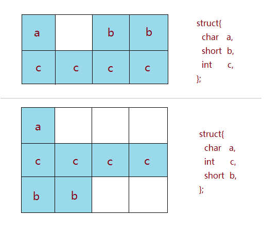
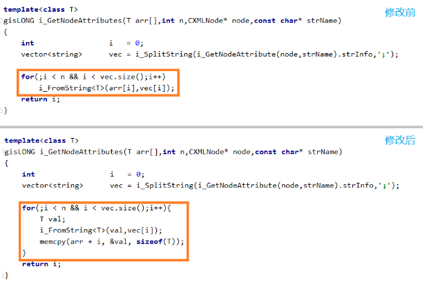
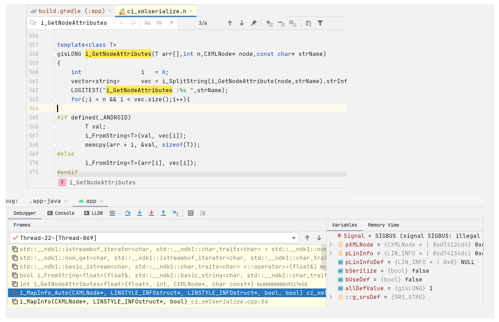

# 10. signal SIGBUS: illegal alignment

For some architecture,eg. SPARC、m68k, when access the illegal alignment address,the CPU will throw the SIGBUS signal;
but for some other architecture,eg. IA-32 from Intel,that is OK;

the last code for the legal alignment address usually is '0','4','8','C';

## 10.1 WHAT is ALIGNMENT




## 10.2 METHOD


1. use memcpy ,not use this illegal alignment address directly

2. redesign the data structure with the reserved space to make the address alignment legally;
   





## 10.3 DEMO


testDemo:

```
	bool Align_noTemplate(float& t, float f){
		t = f; return true;
	} 
	template<> inline bool Align(float& t, float f){
		t = f; return true;
	}
	template<class T> bool Align_Float(T& t, T f){
		t = f; return true;
	}
	test()
	{
	LIN_INFO linInfo;float fVal = 1.8;
	linInfo.xscale = fVal;                        ///1.use =,          OK
	memcpy(&linInfo.xscale, &fVal, sizeof(float));///2.memcpy,         OK
	Align_noTemplate(linInfo.xscale, fVal );      ///3.no template     OK
	Align_Float(linInfo.xscale, fVal );           ///4.template.temp   OK
	linInfo.xscale = fVal;
	Align_Float(linInfo.xscale, fVal );           ///5.template.direct BAD
	}


	char szBuffer[512] = { 0 };
	memset(szBuffer,1,sizeof(char)*512);
	for(int m = 0; m < 16;m++){
		float fVal = 1.8;
		char* ptr = (szBuffer+m);
		float* pfVal = (float*)ptr;
		fVal = *pfVal; 
		Align_noTemplate(*pfVal, fVal); ///1. OK
		Align_Float(*pfVal, fVal);      ///2. sometimes BAD
	}

```


## 10.4 Link ERROR



Case description:

1. the application is broken down and throw the SIGBUS signal; 
   the signal give the illegal allignment detail;

2. when we check the logic,for the variable which has the illegal allignment address,
   we have fix it with 'memcpy' method; 
   despite the fixes,the cpu give the SIGBUS signal;

3. then debug the function,in the debuger stack we find the error line is 'Gray' ,
   but the upper logic function line is 'Black'; the Gray line is not located in the right place;
   To check this,we add the log with 'LOGITEST' in the target function,recompile and run,
   we CANNOT get the log in the logcat window; which indicate that maybe the library link the the wrong function;

4. when rename and relink the target function ,compile and run, we can get the log and the SIGBUS signal disappear;

5. for this case, from the outside,the illegal allignment SIGBUS is the orignal question essentially;  
   deal it with 'memcpy' method is the right choice;
   But in the library we maybe find the target function more than once which may have different logic,
   especially when we merge many many static libs into one dynamic library;

6. rename the target function or recall the function with the unique namespace ,
   through this we fix this question;

7. so when we copy the existed functions,prefer to Surround the functions with the unique name space or rename the functions ,
   to make them unambiguous;

