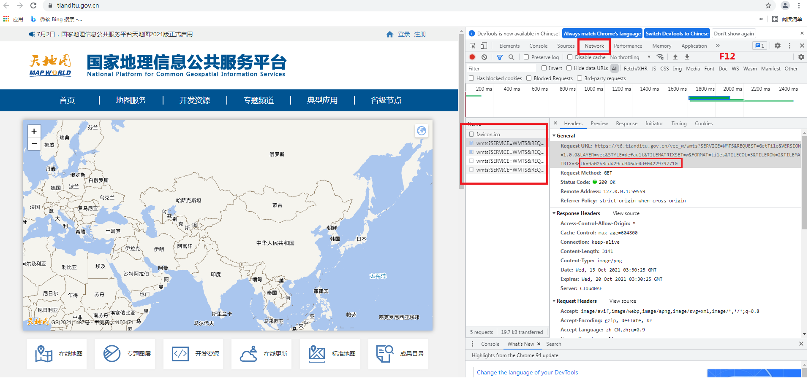

# 26. how to get tianditu token

STEPS:
 * 1. visit 'tianditu.gov.cn' in chrome browser;
 * 2. Press 'F12'and show the right window;
 * 3. click and drag or move or zoom in or zoom out the left map;
      some information will list in the right window;
 * 4. choose the 'NetWork' tab,in 'Name' window list the requests,choose any one;
 * 5. in Headers tab, 'General' Node,we get the URL:
  
      https://t6.tianditu.gov.cn/vec_w/wmts?SERVICE=WMTS&REQUEST=GetTile&VERSION=1.0.0&LAYER=vec&STYLE=default&TILEMATRIXSET=w&FORMAT=tiles&TILECOL=55&TILEROW=24&TILEMATRIX=6&tk=9a02b3cdd29cd346de4df04229797710
* 6. in the above URL,get the value of the key 'tk' 
    
	 Ok, we get the tianditu token: 9a02b3cdd29cd346de4df04229797710