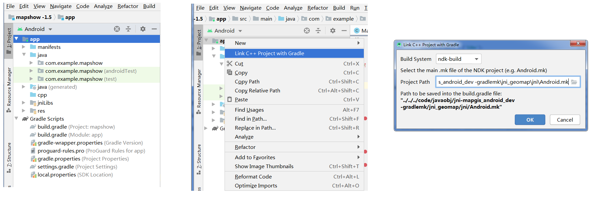

# 9. Debug cpp module in Android studio



STEPS:

1. open project in android studio;
2. select Android Node,not Project Node,
3. select app tree root node,and click the mouse right button,
   get the menu lists;
4. click 'Link c++ project with Gradle' from the menu
   the show the configure window
5. if the *.mk file is Ok,choose ndk-build for Build system;
   then choose the file 'Android.mk' in the project path;
6. press ok,add the mk config into the build.gradle;
  ```
    android {

      compileSdkVersion 26
      defaultConfig {
        applicationId "com.map.cycle"
        minSdkVersion 21
        targetSdkVersion 26
        versionCode 1
        versionName "1.0"
        testInstrumentationRunner "android.support.test.runner.AndroidJUnitRunner"
        multiDexEnabled true
        ndk {
          abiFilters "armeabi-v7a"
        }
      }
      externalNativeBuild {
        ndkBuild {
          path file('../../code/build/map/jni/Android.mk')
        }
      }
    }

  ```
