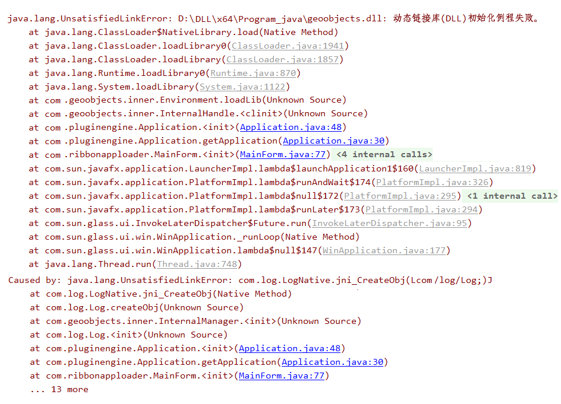

# 8. A dynamic link library (DLL) initialization routine failed

use IntelliJ IDEA to debug some program, when load some dynamic link library (*.dll),
throw out some error infomation: "A dynamic link library (DLL) initialization routine failed" ;

when check the dll file ,the file exist and the located path has been set in the Computer PATH ENV,
besides this,use the dependency tool(dependency walker), we get the full complete dependent file list in the table view;

the method to solve this situation:

1. cmd --->regedit 
2. locate the target program node;
   eg: HKEY_CURRENT_USER\Software\MapCycle\AppProduct\Developer
3. delete the java node which set the java infomation,
   and node name make consist of the HEX code;

 regedit path

